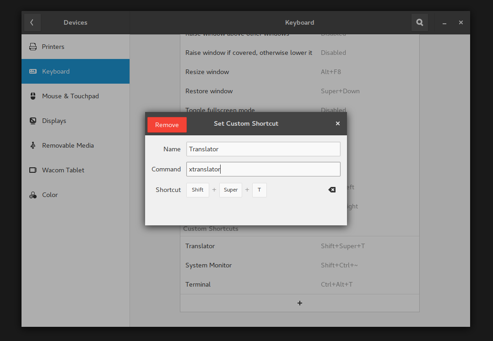
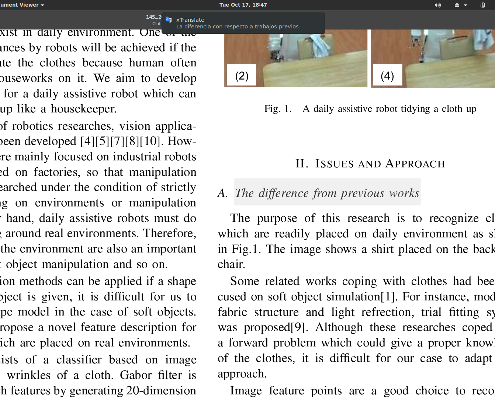
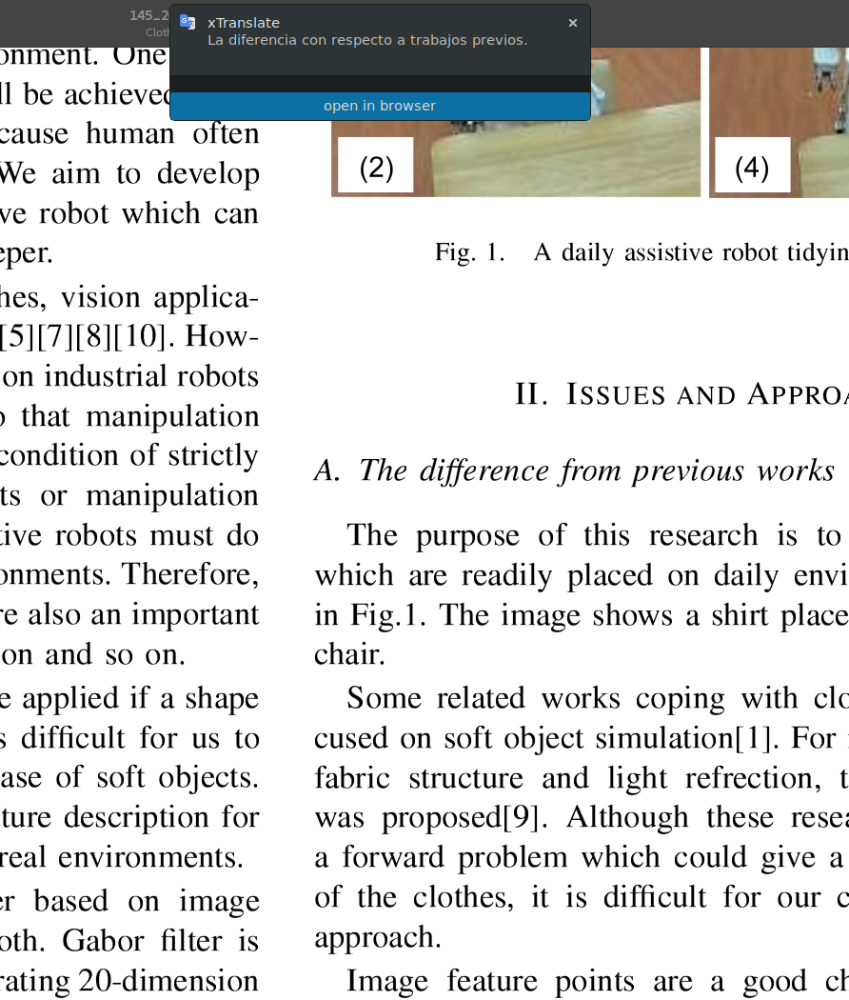

# xTranslate

this is just a very simple hackeable python script that translates selected text (or from clipboard) and show the result as a notification. It works using **xsel**, [translate-shell](https://github.com/soimort/translate-shell) and **libnotify**

## dependencies
* translate-shell
* libnotify
* xsel

## usage
place the script and **gt_icon** wherever you want and add execute permission.
set up a trigger: I use a keyboard short cut to trigger the script

* `-h`: display help
* `-tr, --translate`: format **lang_src:lang_dest**. default `en:es`. see [translate-shell](https://github.com/soimort/translate-shell) for more info
* `-t --timeout`: notification timeout in milliseconds. default `5000`
* `-p --params`: **translate-shell** coma separated additional params. default `b` (brief translation)

## features

* translate any selected text or text from the clipboard. please take in account the limitations of translate-shell. 
* open in browser: opens **translate.google.com**. The url arguments are source and destination language and the text to translate. If source is empty (**:es**) it sends **auto** param for autodetection mode. see google translate query docs for customizations

## screenshots

## TODO
- [ ] support for other translators availables in **translate-shell**
- [ ] make arch linux package
